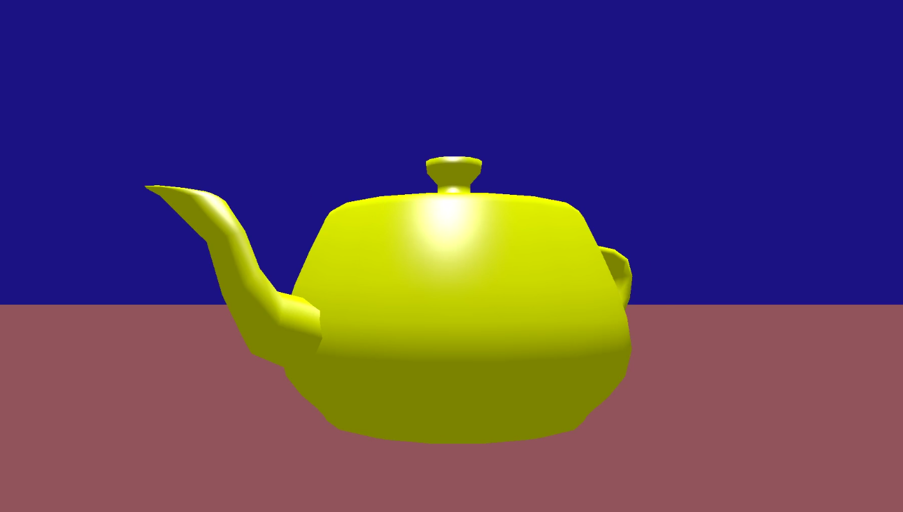

# TEAPOT RENDER
It's some sort of "Hello World" for OpenGL. Simple render which shows how to use primitive shaders, FPS-camera and camera movement.


## Quick Start
1. [Install Rust](https://www.rust-lang.org/tools/install)
2. Run
```bash
cargo run
```
3. Navigate with "WASD"


<a href="url"></a>
